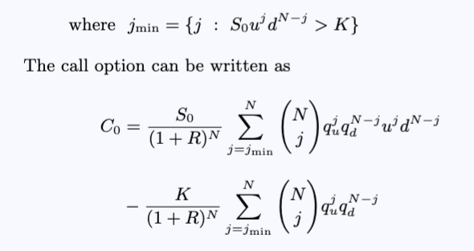
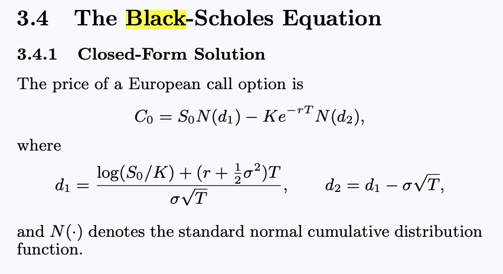

---

# Motivation

After suitable condensation, the price of a vanilla option under the multi-period binomial model can be expressed using the Cox–Ross–Rubinstein (CRR) formula, shown below:

One may immediately notice the strong similarity between this expression and the Black–Scholes formula:

This work shows the convergence of the models under certain conditions, why this happens, and explores some interesting background, applications, and optimisations.
---

## Project goals

- Introduce the core financial instruments, with a detailed exposition of the structure of European vanilla options.
- Present the key mathematical foundations underlying both the Black–Scholes model and the binomial model.
- Show the binomial model option price at a granular level, explicitly demonstrating its convergence to the analytical Black–Scholes solution.
- Implement the Black–Scholes model in C++ and numerically demonstrate the convergence of the Cox–Ross–Rubinstein model as the number of time steps increases.
      This includes a numerical optimisation to prevent factorial values from reaching type limits.
- Identify, analyse, and present key observations arising from the numerical experiments.
- Conduct a literature review, including a discussion of the trinomial model.
- Explore extensions to more complex instruments, specifically American options.
